# Phần 1: Giới thiệu

## 1.1 Phân tích phân khúc khách hàng
Phân tích phân khúc khách hàng là quá trình chia khách hàng thành các nhóm nhỏ hơn dựa trên các đặc điểm chung như hành vi, nhu cầu, sở thích... Mục đích của phân tích phân khúc khách hàng là:

* Hiểu rõ hơn về khách hàng: Phân tích phân khúc khách hàng giúp doanh nghiệp hiểu rõ hơn về nhu cầu, sở thích, hành vi của từng nhóm khách hàng.
* Tạo ra chiến lược marketing hiệu quả hơn: Bằng cách nhắm mục tiêu vào từng phân khúc khách hàng cụ thể, doanh nghiệp có thể tạo ra các chiến dịch marketing hiệu quả hơn, thu hút được nhiều khách hàng hơn và tăng doanh thu.
* Cải thiện sản phẩm và dịch vụ: Phân tích phân khúc khách hàng cũng giúp doanh nghiệp cải thiện sản phẩm và dịch vụ của mình bằng cách tập trung vào những gì mà khách hàng mong muốn.

Mục đích của cùng của việc phân tích phân khúc khách hàng là để tăng doanh số bán được từ đó tạo lợi nhuận cho doanh nghiệp. Và để tăng doanh thu thì có 2 hướng chính:
* Tăng số lượng khách hàng: thông qua các hoạt động quảng cáo trên các phương tiện truyền thông.
* Tăng chất lượng khách hàng: khiến cho những khách hàng thân thiết tiếp tục gắn bó, mua hàng nhiều hơn và khiến cho những khách hàng thông thường trở thành khách hàng thân thiết.

## 1.2 Chỉ số R-F-M
RFM là viết tắt của Recency, Frequency, Monetary, là ba chỉ số quan trọng trong phân tích phân khúc khách hàng:

* Recency (Tần suất mua hàng gần đây): Cho biết thời gian kể từ lần mua hàng gần nhất của khách hàng.
* Frequency (Tần suất mua hàng): Cho biết số lần mua hàng của khách hàng trong một khoảng thời gian nhất định.
* Monetary (Giá trị giỏ hàng): Cho biết mỗi khách hàng thường bỏ ra bao nhiêu tiền để mua hàng.

>**Dự án này sẽ tập trung vào việc chia khách hàng thành các phân khúc để lập ra chiến lược cho từng phân khúc nhằm tăng chất lượng khách hàng.**


# Phần 2: Phân tích dữ liệu
## 2.1. Lấy dữ liệu
Tất cả nguồn dữ liệu trong bài này được lấy từ [kaggle](https://www.kaggle.com/) <br>
Vì nhóm sử quyết định phân tích dữ liệu bằng Python thông qua Google Collab nên sẽ lấy dữ liệu bằng cách:
* Dữ liệu dùng để phân tích được lưu trong SQL Server, sau đó xuất ra file excel bằng công cụ SQL Native Client.
* Tiếp đến tải dữ liệu lên lên Google Drive.
* Sử dụng các thư viện drive và hàm drive.mount() để kết nối với Google Collab với Google Drive.
* Đọc file excel thông qua đường dẫn từ drive.
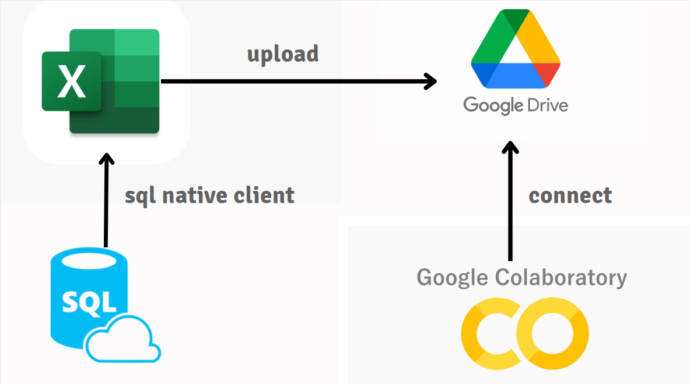

## 2.2. Tiền xử lý dữ liệu
### 2.2.1 Xử lý missing data
Sử dụng phương thức df0.isna().sum() để đếm số lượng phần tử rỗng/ không xác định thấy được:
* Thuộc tính  CustomerID có 135080 dòng trống / dữ liệu không xác định
* Thuộc tính Description không dùng để phân tích nên bỏ qua.
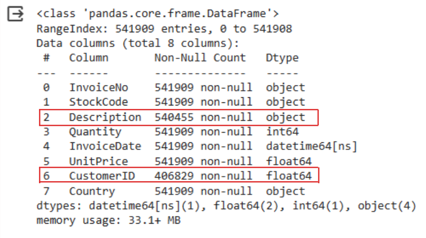

<br>Vì 1 đơn hàng chỉ được mua bởi 1 khách hàng => Có thể điền một số mã khách hàng (CustomerID) còn thiếu dựa vào mã đơn hàng (InvoiceNo).
<br>Bằng cách tạo một dictionary với key: InvoiceNo ; value: CustomerID.
```Python
    InvoiceCustomer_dict = df0.groupby('InvoiceNo')['CustomerID'].first().to_dict()
```

Cập nhật cột CustomerID của DataFrame df0 bằng cách sử dụng apply(). Nếu giá trị trong cột CustomerID là không rỗng, giá trị đó sẽ được giữ nguyên. 
<br>Nếu giá trị là rỗng, chương trình sẽ tìm trong InvoiceCustomer_dict giá trị tương ứng với InvoiceNo, nếu không tìm thấy thì sẽ giữ nguyên giá trị ban đầu.
```Python

    df0['CustomerID'] = df0.apply(lambda row: row['CustomerID'] if pd.notna(row['CustomerID'])
                    else InvoiceCustomer_dict.get(row['InvoiceNo'], row['CustomerID']), axis=1)
```

Sau khi cập nhật xong, ta sẽ tạo một DataFrame mới tên df bằng cách loại bỏ các hàng có CustomerID hoặc InvoiceNo là rỗng.

```Python
    df = df0.dropna(subset=['CustomerID', 'InvoiceNo'],how = 'any')
```
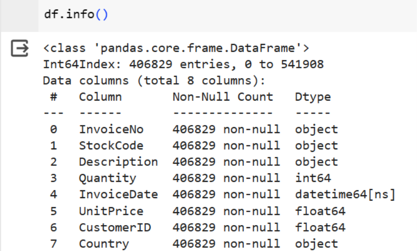
### 2.2.2 Xử lý outlier
Sử phương thức df.describe() để có cái nhìn tổng quan về dữ liệu trong df0, như số lượng hàng, sự phân bố của các giá trị, và các giá trị ngoại lệ.
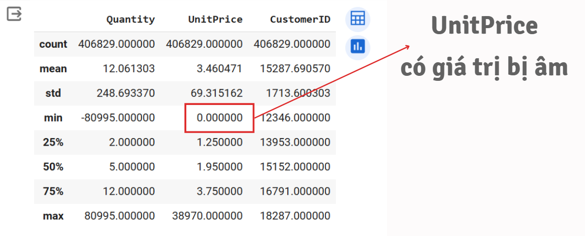
Ta thấy rằng một số dòng Unitprice bị âm nên ta sẽ loại bỏ nó đi.

```Python
   df = df[df['UnitPrice'] > 0]
```

### 2.2.3 Xử lý duplicate
Sau đó sử dụng phương thức df.drop_duplicates để loại bỏ giá những dòng bị trùng.
```Python
  df.drop_duplicates(inplace = True)
```

### 2.2.4 Xử lý noisy
Không có vì mỗi dòng đều là dữ liệu của khách hàng đã mua hàng.
## 2.3 Tính các chỉ số RFM
### 2.3.1 Recency
Recency: Lần mua hàng gần đây nhất cách thời điểm hiện tại bao nhiêu ngày
Để giá trị Recency không bị quá lớn, ta chọn trong tập dữ liệu bằng cách tìm giá trị lớn nhất của cột 'InvoiceDate' và cộng thêm 1 ngày.
Sau đó chuyển đổi cột 'InvoiceDate' từ kiểu chuỗi sang kiểu datetime để có thể thực hiện các phép tính ngày tháng.
Nhóm dữ liệu theo 'CustomerID', với mỗi nhóm lấy hiệu giữa cur_date (ngày gần nhất) và ngày lập hóa đơn gần nhất của khách hàng.
```Python
  cur_date = max(df['InvoiceDate'] + datetime.timedelta(days= 1))
  df['InvoiceDate']= pd.to_datetime(df['InvoiceDate'])
  Recency = df.groupby('CustomerID').agg({'InvoiceDate': lambda d:  (cur_date -d.max()).days  })
```

### 2.3.2 Frequency
Frequency: Được tính bằng cách lấy tích số lần khách hàng đã mua hàng và mỗi lần khách hàng mua bao nhiêu loại hàng. 
Vì mỗi dòng trong df tương ứng với một dòng hóa đơn, và cũng là 1 loại món hàng mà khách hàng đó đã mua, nên chỉ cần nhóm theo CustomerID và đếm số dòng bằng phương thức count().
```Python
    Frequency = df.groupby('CustomerID')['InvoiceNo'].count()
```
#### 2.3.2 Monetary Value
Monetary Value: Tổng số tiền mà khách hàng đã chi.
Tạo thuộc tính mới tên ‘Total’ bằng cách lấy số lượng món hàng (Quantity) nhân với giá của món hàng đó(Unit Price), sau đó nhóm theo CustomerID và dùng phương thức sum() để tính tổng giá trị các đơn hàng của khách hàng.
```Python
    df['Total'] = df['UnitPrice'] * df['Quantity']
    Montary = df.groupby('CustomerID')['Total'].sum()
```
Tạo dataframe hoàn chỉnh 
```Python
    rfm = pd.concat([Recency,Frequency,Montary],axis = 1)
    rfm.columns = (['Recency','Frequency','Montary Value'])
```
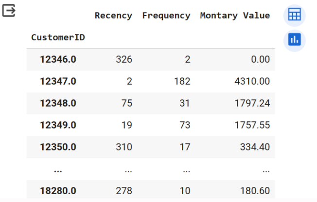
## 2.4 Rời rạc hóa các chỉ số RFM
Sử dụng thư viện matplotlib.pyplot và các hàm vẽ biểu đồ để vẽ sự phân bố số lượng khách hàng theo các giá trị RFM
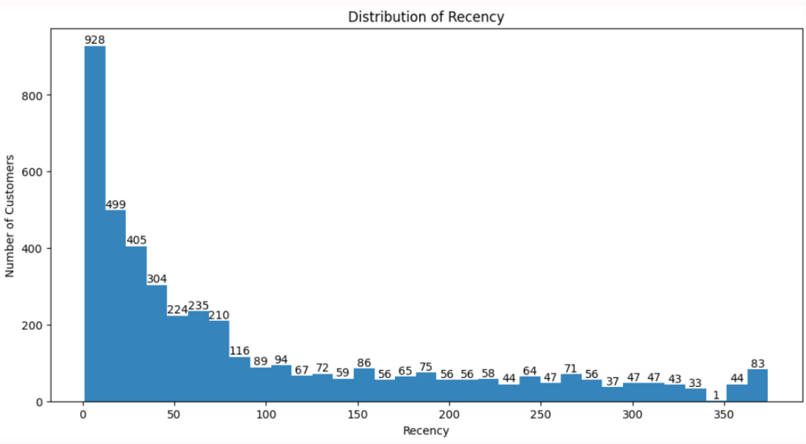

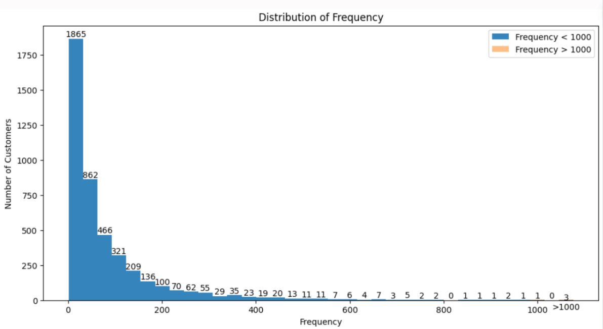

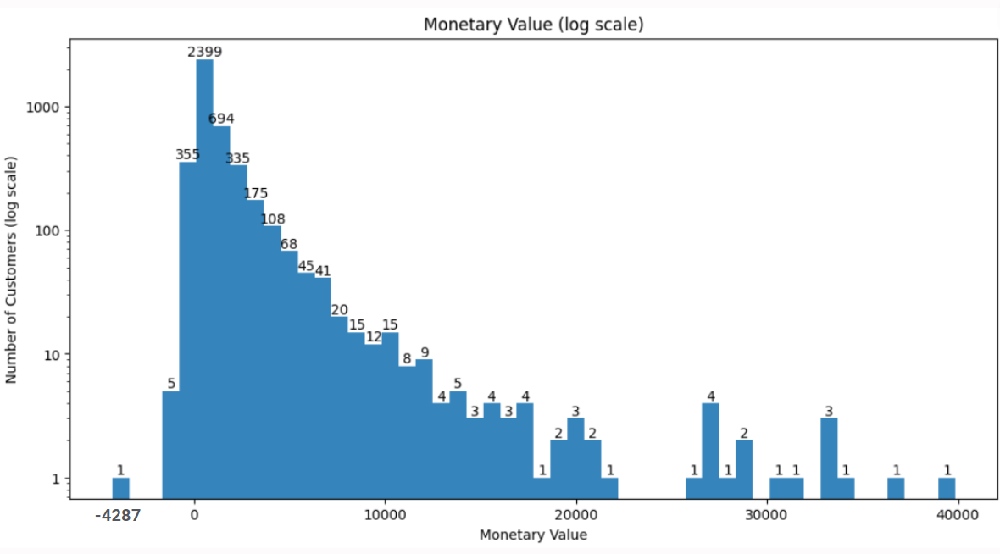

Sử dụng phương thức describe() để xem các phân vị của dataframe
```Python
   rfm.describe()
```
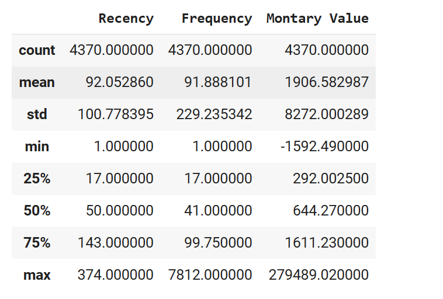

Dựa vào sự phân bố của các chỉ số RFM ta tiến hành rời rạc hóa chúng
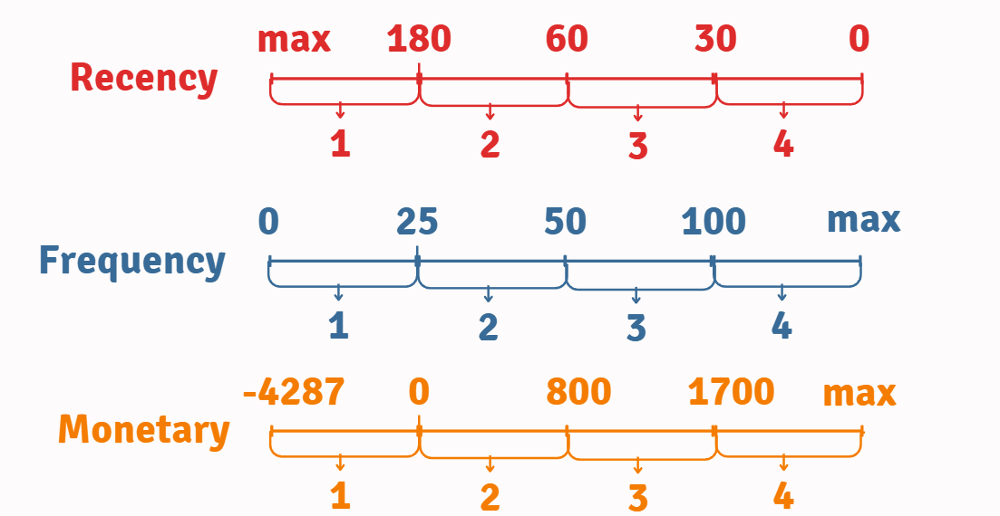

```Python

    bins_r = [0, 30, 60, 180, float('inf')]
    labels_r = [4, 3, 2, 1]

    bins_f = [0, 25, 50, 100, float('inf')]
    labels_f = [1, 2, 3, 4]

    bins_m = [-4287, 300, 800, 1700, float('inf')]
    labels_m = [1, 2, 3, 4]
    
    r = pd.cut(rfm['Recency'], bins = bins_r, labels=labels_r)
    f = pd.cut(rfm['Frequency'],bins=bins_f, labels=labels_f)
    m = pd.cut(rfm['Montary Value'],bins=bins_m, labels=labels_m )
    rfm['R-F-M'] = r.astype(str)+ '-' + f.astype(str) + '-' +m.astype(str)
```

<br>Kết quả
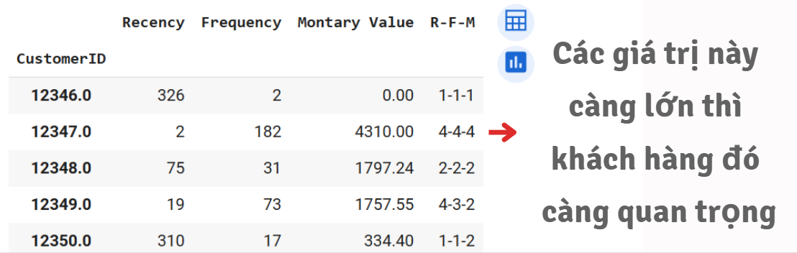

## 2.5 Chia khách hàng thành các phân khúc
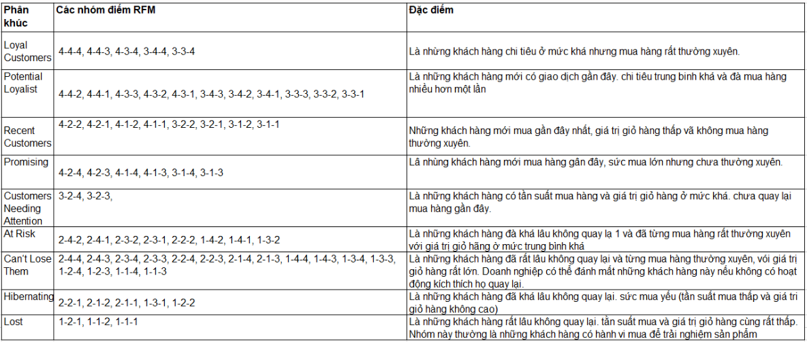

## 2.6 Lấy danh sách khách hàng của từng phân khúc
Lấy danh sách khách hàng từ file excel
```Python
    df_cu = df0 = pd.read_excel('/content/drive/MyDrive/PTDL/Customer Segment Analysis/dataset/CustomerDetails.xlsx')
    df_cu
```
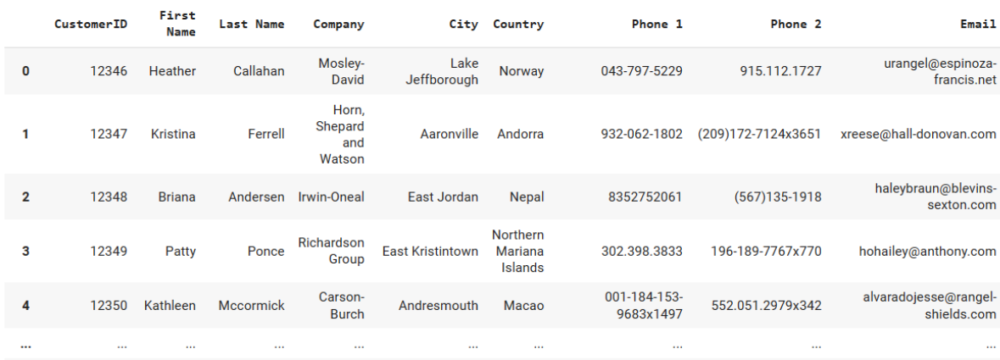

<br>Lấy danh sách khách hàng của từng phân khúc
```Python
    df_loyal = pd.merge(df_cu, Loyal_Customer, on='CustomerID', how='inner')
    [['CustomerID', 'First Name','Last Name', 'Company','City', 'Country','Phone 1',
      'Phone 2','Email', 'Subscription Date','Website']]
    df_loyal.to_excel('loyal.xlsx')
```
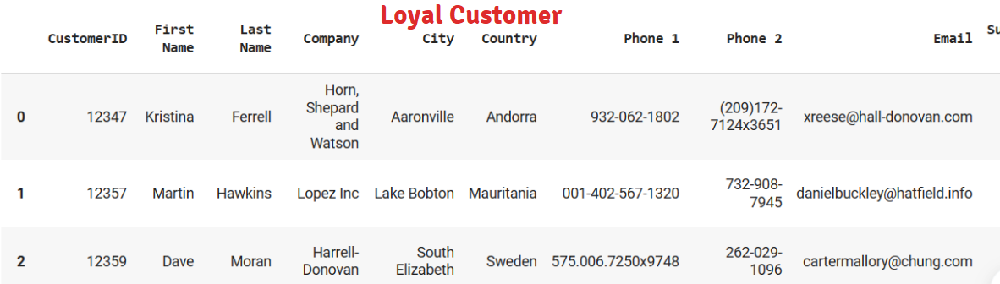

<br>Kết quả

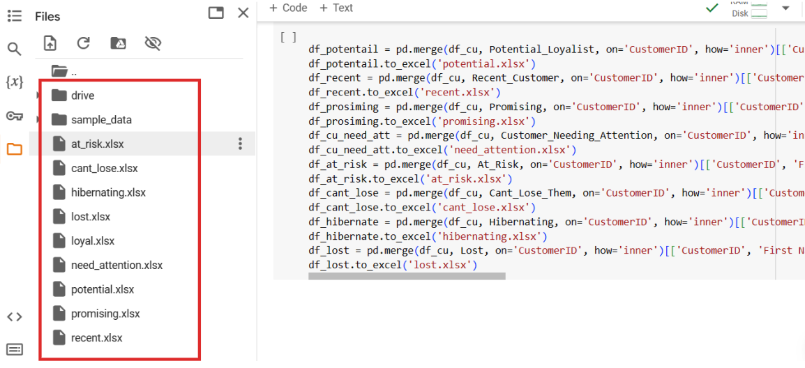

# Phần 3: Lập chiến lược cho từng phân khúc khách hàng

## 3.1 Loyal Customers
||Loyal Customers|
|-----|-----------------------------------------------------------------------------------------|
|Điểm| '4-4-4', '4-4-3', '4-3-4', '3-4-4', '3-3-4' |
|Đặc điểm| Là những khách hàng chi tiêu hàng đầu tại cửa hàng |

Những khách hàng này có khả năng chi tiêu tốt và có thói quen mua sắm thường xuyên, nên việc giữ chân họ là rất quan trọng. Các  chương trình khách hàng thân thiết cùng với các ưu đãi dành riêng cho họ, chẳng hạn như tích điểm đổi quà và giảm giá cho các đơn hàng trong tương lai sẽ tạo động lực để họ tiếp tục mua hàng.


## 3.2 Potential loyalist
||Potential loyalist|
|-----|-----------------------------------------------------------------------------------------|
|Điểm|  '4-4-2', '4-3-3',  '3-4-3', '3-4-2', '3-3-3' |
|Đặc điểm| Là những khách hàng mới có giao dịch gần đây, chi tiêu nhiều và đã mua hàng nhiều hơn một lần |

Đây là nhóm khách hàng có tiềm năng lớn. Việc giữ liên lạc bằng cách gửi email khuyến mãi thường và lắng nghe phản hồi của họ thông qua khảo sát sẽ giúp tăng cường mối quan hệ và khuyến khích họ quay lại.

## 3.3 Recent Customers
|| Recent Customers|
|-----|-----------------------------------------------------------------------------------------|
|Điểm|  '4-2-2', '4-2-1', '4-1-2', '4-1-1', '3-1-2', '3-1-1' |
|Đặc điểm| Là những khách hàng mới mua gần đây nhất, giá trị giỏ hàng thấp và không mua hàng thường xuyên |

Đối với nhóm khách hàng này ta cần thúc đẩy họ mua hàng thêm lần nữa bằng cách giới thiệu sản phẩm tương tự hoặc cao cấp hơn, kết hợp với các ưu đãi giới hạn thời gian. Điều này giúp tăng giá trị đơn hàng, tạo ấn tượng tốt đối với họ từ đó khuyến khích họ trở thành khách hàng thường xuyên.

## 3.4 Promising
|| Promising|
|-----|-----------------------------------------------------------------------------------------|
|Điểm| '4-2-4', '4-2-3', '4-1-4', '4-1-3', '3-1-4', '3-1-3'|
|Đặc điểm| Là những khách hàng mới mua hàng gân đây, sức mua lớn nhưng chưa thường xuyên |

Sử dụng đội ngũ chăm sóc khách hàng để tạo ấn tượng tốt bằng cách gọi điện hoặc gửi thư cảm ơn. Đồng thời, đề xuất các sản phẩm cao cấp và cung cấp ưu đãi đặc biệt cho lần mua hàng tiếp theo để khuyến khích họ quay lại và mua hàng thường xuyên hơn.

## 3.5 Customers Needing Attention
||Customers Needing Attention|
|-----|-----------------------------------------------------------------------------------------|
|Điểm|  '3-2-4', '3-2-3', '2-4-4', '2-4-3', '2-4-2' |
|Đặc điểm| Là những khách hàng có tần suất mua hàng và giá trị giỏ hàng ở mức khá, chưa quay lại mua hàng gần đây |

Gửi thông báo về các khuyến mãi đặc biệt hoặc tặng quà nhỏ để nhắc nhở và khuyến khích họ quay lại. Đồng thời, thực hiện khảo sát để tìm hiểu lý do họ chưa quay lại, từ đó điều chỉnh chiến lược phù hợp.

## 3.6 At Risk
||At Risk|
|-----|-----------------------------------------------------------------------------------------|
|Điểm| '2-4-2', '2-4-1', '2-3-2', '2-3-1', '2-2-2', '1-4-2', '1-4-1', '1-3-2' |
|Đặc điểm| Là những khách hàng đà khá lâu không quay lại và đã từng mua hàng rất thường xuyên với giá trị giỏ hãng ờ mức trung bình khá |

Bằng cách gửi email với ưu đãi đặc biệt hoặc tặng voucher khi họ quay lại mua hàng, đồng thời thường xuyên cập nhật thông tin về sản phẩm mới và những thay đổi tích cực để khơi dậy sự quan tâm của họ.

## 3.7 Can't Lose Them
||Can't Lose Them|
|-----|-----------------------------------------------------------------------------------------|
|Điểm|  '2-4-4', '2-4-3', '2-3-4', '2-3-3', '2-2-4', '2-2-3', '2-1-4', '2-1-3', '1-4-4', '1-4-3', '1-3-4', '1-3-3', '1-2-4', '1-2-3', '1-1-4', '1-1-3' |
|Đặc điểm| Là những khách hàng đã rất lâu không quay lại và từng mua hàng thường xuyên, vói giá trị giỏ hàng rất lớn|

Ta cần tiến hành mời họ tham gia vào chương trình khách hàng VIP với nhiều đặc quyền và ưu đãi lớn để khuyến khích họ quay lại. Gửi thông điệp cá nhân hóa và khảo sát lý do họ rời bỏ để điều chỉnh dịch vụ, nhấn mạnh vào việc doanh nghiệp rất mong họ quay lại.

## 3.8 Hibernating và Lost
||Hibernating|
|-----|-----------------------------------------------------------------------------------------|
|Điểm|  '2-2-1', '2-1-2', '2-1-1', '1-3-1', '1-2-2' |
|Đặc điểm| Là những khách hàng đã khá lâu không quay lại. sức mua yếu  |


||Lost|
|-----|-----------------------------------------------------------------------------------------|
|Điểm|  '1-2-1', '1-1-2', '1-1-1' |
|Đặc điểm| Là những khách hàng rất lâu không quay lại. tằn suất mua và giá trị giỏ hàng cùng rất thấp |

Cả 2 phân khúc này thường là những khách hàng mua sản phẩm chỉ để trải nghiệm sản phẩm, nên chỉ cần tiến hành những hoạt động quảng cáo trên các phương tiên thông tin truyền thông để thu hút thêm các khách hàng mới

